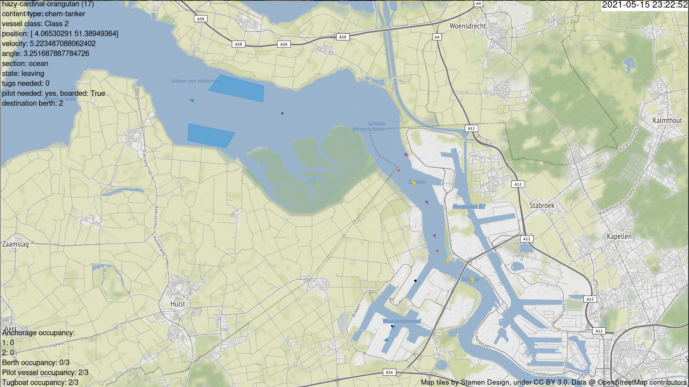

# PySeidon - A Data-Driven Maritime Port Simulator 🌊 



Extendable and modular software for maritime port simulation.

This software uses [entity-component system](https://en.wikipedia.org/wiki/Entity_component_system) approach making it highly customizable for various end goals and easily built upon.

## Overview

PySeidon was primarily designed for port scenario testing, but can be used for a variety of other tasks. Software can be adapted to simulate any maritime port provided that the [required data is available](https://dke-2019-2020-marble-port-of-rotterdam.gitlab.io/harbour-simulation/data/).
The simulator can be tested with different factors, such as:
- New/different anchorage location
- Different number of tugboat/pilots available
- Different priority order depending on ship class/size
- Etc...

PySeidon's output can then give useful insights whether the given change improves certain Key Performance Indicators (check [this repository](https://gitlab.com/pyseidon/ais-tools) for scripts to analyse simulation results).

PySeidon can be used to create new data for various downstream tasks (e.g. anomaly detection), approximate impact on Key Performance Indicators of some decision, novelty introduced in a port.
The supplemental visualization software can be used to analyse general (or created by simulation) [AIS data over time](https://gitlab.com/pyseidon/ais-visualization) or [analyse simulation states](https://gitlab.com/pyseidon/simulator-flow-analysis) (for debugging).

## Installation and Demo

The framework is bundled with an example model to get you started. To run it first install the dependencies by running `pip install -r requirements.txt`. Pip might complain about `libgeos` not being installed on your system. On Ubuntu you can install it by running `sudo apt-get install libgeos-dev`.

Once the required libraries are installed run the example model with the following command (it may take a bit for the first vessel to spawn)

```sh
python main.py          \
    --out sim-output    \
    --step 10           \
    --verbose y         \
    --graphics y        \
    --cache y           \
    --seed 567
```

## Features

- Simulation of the following agents and infrastructure elements
  - Agents: vessel, tugboats, pilots
  - Infrastructure components: berths, anchorages, tugboat rendezvous and storage locations, pilot rendezvous and storage locations
  - Introduction of anomalies such as randomized berth inspections, tugboat malfunctions, anomalous vessel velocity. These can be used to create
  datasets that are currently not available
- Visualization of the simulation: infrastructure components and agents, including an overview of vessel and berth information at any moment in time
- Simulation of anomalies: random berth inspection, tugboat malfunctions, unusual vessel velocities
- Clean way of conducting experiments of the simulation (multiple runs, no graphics, aggregating output data of the simulation)
- The simulation engine relies on the input data, minimal actual code modification (model and `main.py`) is required to adapt to different maritime ports if no additional features are to be implemented


## Documentation

For detailed instructions how to install and use PySeidon, see the [Documentation](https://pyseidon.gitlab.io/pyseidon).

## Future work

- Various external factors such as weather, tide, etc.  
- Implement proper nautical rules
- Loading simulation from a saved state
- GUI to enable non-experts be able to use the software
- Boatmen agent
- Better vessel acceleration model, PID controller
- Automatic data analysis at the end of simulation
