# Architecture

## Entity-component systems

The simulation framework is based on the ESC [Esper](https://github.com/benmoran56/esper). This ECS system consists of the following elements:

- **Entities**: labels that represent simulated entities (vessels, berths, etc.). They have no properties or methods. Components provide properties and processors provide method implementations
- **Components**: data objects (such as position, velocity, etc.). They should **NOT** include any method or computation
- **Processors**: classes that process a set of entities identified by their components. For example a vessel entity might be characterized by a position, velocity and vessel_info components

As an example consider the mock simulation world in the figure below. There are two classes of entities, namely `Vessel` and `Terminal` which are respectively composed by (`Position`, `Path`) and (`Position`). Each system processes a subset of entities at each tick of the simulation, for example, the `Rendering` system will query all entities who have a `Position` component and display them on-screen, while the `Movement` system will only care about entities with `Position` and `Path` components.

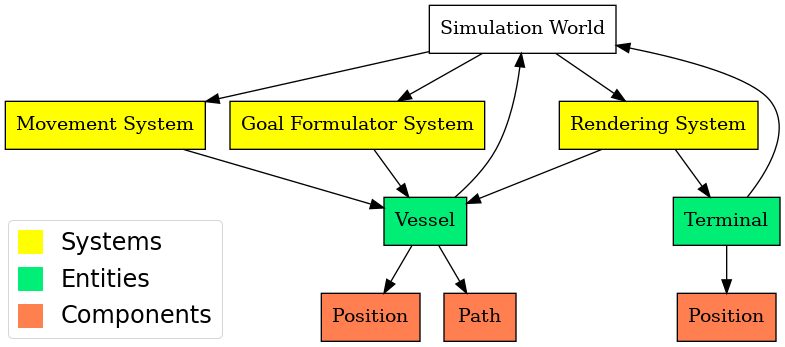

### Packages

This section provides a schematic overview of the major packages that compose the simulation framework

#### Components

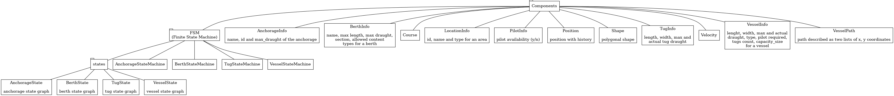

#### Environment

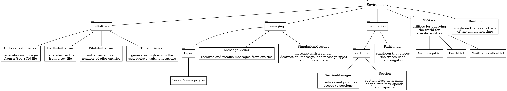

#### Miscellaneous

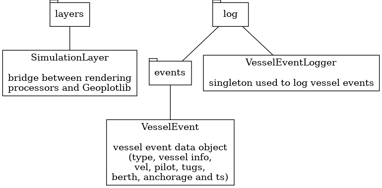

#### Processors

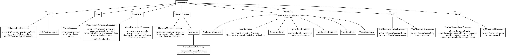

---

## Simulated agents and infrastructure

The simulation can simulate the following agents and infrastructure components:

### Agents

#### Vessel

The ship which needs the port services for loading/unloading cargo, maintenance, fuel, etc.
The behavior of incoming vessels is simulated using the following state machine:

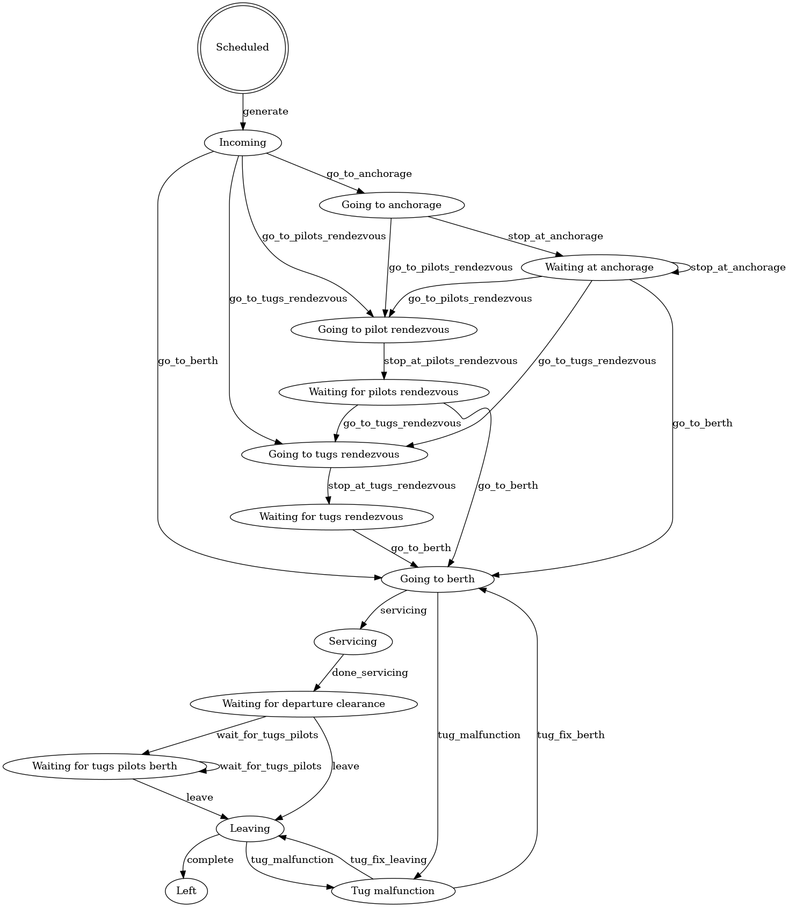

Following the previous diagrams vessels are either routed to an anchorage, a rendezvous or straight to the terminal depending on resources requests and availability (a more detailed diagram is shown in the messaging section).

The navigation of vessels is simulated using paths extracted (and augmented) from AIS data. Movement is simulated using a simple speed based model (where acceleration/deceleration is instantaneous).

#### Pilots

Pilots (working for the port) assist vessels entering or leaving a port. Pilots do so as they are experts of the port infrastructure and navigating big vessels in the port.

The pilots are described by the following FSM diagram:

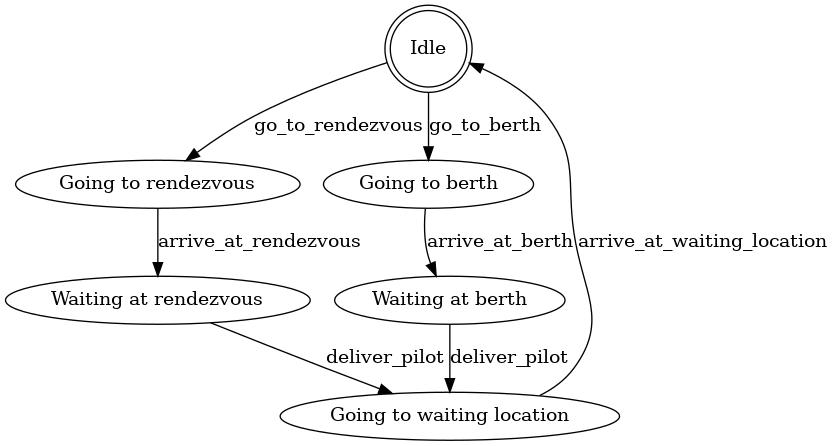

#### Tugboats

A tugboat is a strongly built powerful boat, that is used for towing and pushing ([Merriam-Webster](https://www.merriam-webster.com/dictionary/tugboat)). Tugboats are used to maneuver large vessels inside the port with more accuracy and precision.

The simulated behavior of tugboats is described by the following FSM diagram:

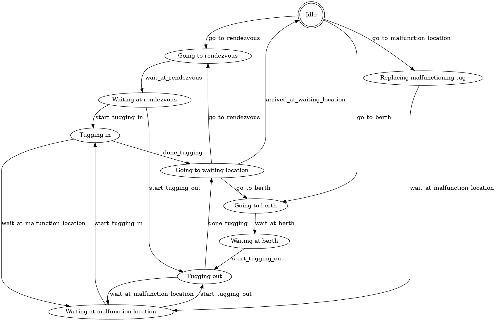

### Infrastructure

#### Berth

The location where a ship lies when being serviced or waiting for departure. Berths are grouped into a terminal, which is usually dedicated to a single cargo type (e.g. oil, containers, etc.)

#### Anchorage

An anchorage is defined as the area where vessels drop anchor, or anchor, awaiting their entry into that part of the harbour reserved for performing typical port type operations (loading, unloading, supplies, repairs, etc.), which however does not exclude these operations frequently being undertaken at the anchorages (Puertos Del Estado, 2007)

#### Tugboats locations

- **Rendezvous locations:** meeting points between vessels and tugboats where tugboats are connected to vessels and the tugging process starts
- **Waiting locations:** locations used to park tugboats when their services are not required

#### Pilot locations

- **Rendezvous locations:** meeting points between vessels and pilots where pilots board the vessel and pilotage starts
- **Waiting locations:** locations used to park pilot tender vessels when their services are not required

#### Port sections

The frameworks allows to separate the port waterways (navigable area inside the port) in sections. Each section has the following constraints:

- Maximum and minimum speed

### Agents communication

The agents in the simulation can communicate via the `MessageBroker`. Each message has a `sender`, a `receiver` a `message_type` and an optional `data` property.

Simulation entities are identified by their entity id and unique agents (such as the harbour master) are identified by a string. In practice, this means that if a vessel (say entity 195) wants to send a message to the harbour master the `sender` will be `ent:195` and the `receiver` will be `harbour-master`. Such a message can be created as follows

```python
message = SimulationMessage(
    sender="vessel:195",
    destination="harbour-master",
    message=VesselMessageType.CHANGE_SECTION)
```

In the current implementation only `vessel` agents communicate with the `harbour-master` agent which takes care of allocating port resources to the vessel. In practice this does not happen, for instance tugboat companies communicate directly with the shipping company that owns the vessel for booking tugs.

#### Vessel messages

Each vessel entity generates the various messages and sends them to the `harbour-master`. The following diagram describes which messages are sent to the `harbour-master` entity at each state of the vessel process (including the decisions taken by the `harbour-master` entity)

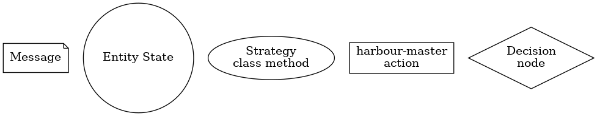

---

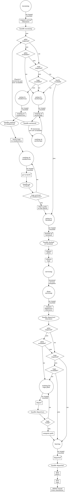

The `harbour-master` processor handles such messages based on a pluggable strategy. The default strategy is in the class `DefaultVesselStrategy`

Moreover, each vessel notifies the harbour-master when it enters/exits a section. These events are not handled directly by the harbour master and a modeller can handle them by setting `on_enter_section` and `on_exit_section` on the `HarbourMasterProcessor` class. For example:

```python
hm_processor = HarbourMasterProcessor(
    world=world,
    vessel_strategy=vessel_strategy,
    logger=vessel_event_logger)

# Handle the vessel exited section event
hm_processor.on_exit_section = lambda msg, ent, vessel_info: ...
```

## Simulated anomalies

### Random berth inspection

There exists a probability *p* that every time a vessel
is serviced at a berth, it might happen that a berth inspection occurs.
In which case, the berth service time is increased by a random time (or, by default, 5 hours).

### Unusual vessel velocities

Using the simulation of the Port of Rotterdam we generated 
anomalies related to a vessel's velocity using a Markov model. 
The markov model, depicted below, has three 
states: normal, fast and slow. In the *slow* and *fast* 
states the vessel's velocity is respectively divided or multiplied 
by a scalar. The arrows in the figure below represent the 
transition probabilities between states and a transition is performed
every two hours (in simulation time).
    
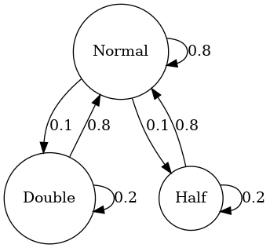

### Tugboat malfunction

There exists a probability *t_i* and *t_b* which denote the chances of the
tugboat malfunctioning in an idle state and in a busy state respectively. If a 
tugboat malfunctions, then the tugboat stops in its current location and is unavailable for
5 hours. After the designated time, it is assumed that the vessel gets fixed and it proceeds
to go to its waiting location for a new assignment. If the tugboat malfunctions in an idle state (without an assignment), then it does
not have a big impact for vessels other than the usual unavailability consequences. If the
tugboat malfunctions and was on its way to a tugboat rendezvous, then a different tugboat is
assigned to that vessel. If a tugboat malfunctions when it is tugging a vessel, then
the vessel (and all other tugging tugboats) stop and wait for a replacement tugboat to arrive.
If a replacement tug is not available, then this check is performed again in 30 simualation minutes (so as to reduce
computational overhead a bit). The vessel (and tugboats) waits until the required amount of tugboats is present.

---