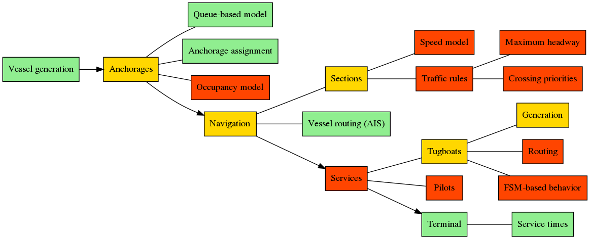
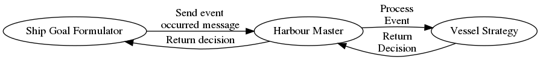

# Port Simulator

This framework is designed to simulate maritime port environments. The system can be de-composed in the following elements:

- Vessel generation: generates new incoming vessels 
- Anchorages 
- Navigation: simulates vessel navigation based on AIS data
- Services: tugboats and pilots
- Terminal: simulate berth operations
- Vessel: vessel strategy, or, in other words, what should the vessel do?
- Messaging: communication system between entities

The image below highlights which simulation components are implemented (green), partially implemented (yellow) and not yet implemented (red).



To quickly run the example model execute the following:

```sh
python main.py          \
    --out sim-output    \
    --step 10           \
    --verbose y         \
    --graphics y        \
    --cache y           \
    --seed 567
```

### Vessel generation

The vessel generation is handled by the `VesselGeneratorProcessor` class, this class requires the following parameters:

- `inter_arrival_time_sampler`: a function _f(vessel_type)_ that returns the sampled inter-arrival time for the next vessel arrival (of the input type)
- `vessel_info_sampler`: a function _f(vessel_type)_ that returns the vessel properties (a `VesselInfo` object, or a subclass) for the given vessel type
- `spawn_area_filename`: path to a geojson file that defines a single polygon, the area in which vessels are generated. See `map_data/ocean/spawn.geojson` for an example

For an example see `example_model/berth_service_distribution_factory.py`

### Anchorages

Anchorages are implemented as a simple FIFO queuing system. Anchorages are loaded from a GeoJSON file with a single `FeatureCollection` containing a list of `Polygons`, each defined as:

```json
{
    "type": "Feature",
    "properties": {
        "name": "1",            // Anchorage name
        "max_draught": 10.0,    // Max draught in meters
        "use": "",              // Optional
        "id": 0                 // Unique anchorage identifier
    },
    "geometry": {
        "type": "Polygon",
        "coordinates": [
            [1.377333, 42.047833],
            [1.305833, 42.065863],
            [1.314286, 42.103538],
            [1.356744, 42.134278],
            [1.367560, 42.136667]
        ]
    }
}
```

See `map_data/anchorages/anchorages.geojson` for a complete example.

The anchorage loading is done via the `AnchoragesInitializer` class in the following way:

```python
anchorages_generator = AnchoragesInitializer(world, anchorages_filename)
anchorages_generator.create_anchorages()
```

The anchorage allocation is explained in the **Vessel** section.

### Navigation

Vessel navigation is simulated using traces extracted from the AIS data. Traces can be created using the tracer tool, stored in the `ais-tracer` repository.

Navigation is handled by the `PathFinder` singleton, which can be initialized in the following way:

```python
path_finder = PathFinder.get_instance()
# traces_folder specifies the path to a folder containing a set of traces in GeoJSON files.
path_finder.load_traces(traces_folder)
```

The PathFinder takes care of finding suitable routes for incoming and departing vessels. Consult the class for further documentation on its workings.

To generate a path from the ocean to a given berth (identified by `berth_id`) use the method `ocean_berth_path()`. To generate a path from a given berth to the ocean use `ocean_berth_path()` and reverse it using `reverse_path()`

### Services

Work in progress

### Terminals and berths

Berths are loaded in the model via the `BerthInitializer`:

```python
# BerthServiceDistributionFactory reads a service times csv file
# and returns the average service time for each berth
berth_service_distribution_factory = BerthServiceDistributionFactory(
    terminal_service_times_filename)

berths_generator = BerthsInitializer(
    world,
    berths_filename,
    berth_service_distribution_factory)

berths_generator.create_berths()
```

The `berths_filename` points to a `.csv` file with the following fields:

- `id`: unique berth identifier
- `name`: berth name
- `lat`: latitude in WSG84 format
- `lon`: longitude in WSG84 format
- `description`: optional description
- `type`: berth type (not used in the model)
- `max_quay_length`: max quay length in meters
- `max_depth`: max depth in meters
- `vessel_types`: allowed vessel classes
- `terminal`: terminal to which the berth belongs to. Terminal names must match the ones in the terminal service times file

The berth identifiers should match the ones used in the traces, so, if a trace $x$ connects the ocean to berth 137 there must exist a berth with id 137 in the berths file.

---

Terminal service times are loaded from a `.csv` file (in the example above `terminal_service_times_filename`) with the following columns:

- `terminal`: name of the terminal
- `section`: section id of the terminal
- `class 1`: average service time in seconds for class 1 vessels
- `class 2`: average service time in seconds for class 1 vessels
- `...`: average service time in seconds for other classes

### Vessel

The behavior of vessel is defined by a strategy class, for an example see the `DefaultVesselStrategy` class. This class is used by the harbour master to decide what should be the next step for the vessel.

```python
# See the class for further documentations
vessel_strategy = DefaultVesselStrategy(
    world=world,
    anchorage_designator=assign_anchorage,
    berth_designator=berth_allocation_designator,
    path_finder=path_finder)
```

The decision system of a vessel is composed of three main elements, the `VesselGoalFormulator`, which zkeeps track of the current goal and generates an event (by sending a message to the Harbour Master) when the current goal is met. The Harbour Master has a `vessel_strategy` object which processes the incoming message and returns a decision, which is then in turn sent back to the vessel.



This structure allows the vessel strategy to be replaced easily by an alternative strategy.

### Messaging

For more information on messaging see `messaging.md`
