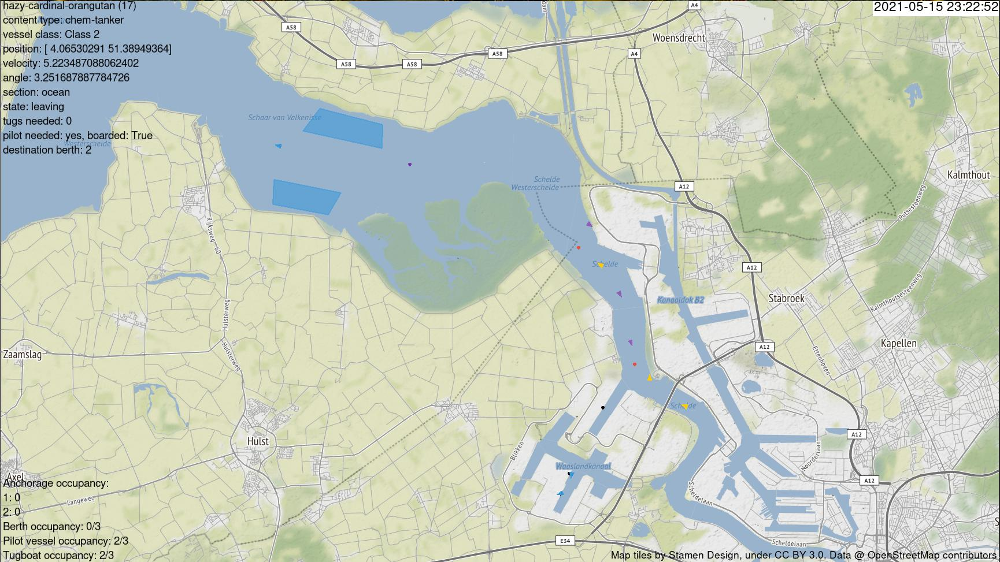

# PySeidon - A Data-Driven Maritime Port Simulator 🌊 



[Pyseidon](https://gitlab.com/pyseidon/pyseidon) is an extendable and modular software for maritime port simulation.

This software uses [entity-component system](https://en.wikipedia.org/wiki/Entity_component_system) approach making it highly customizable for various end goals and easily built upon.

## Overview

PySeidon was primarily designed for port scenario testing, but can be used for a variety of other tasks. Software can be adapted to simulate any maritime port provided that the [required data is available](data.md).
The simulator can be tested with different factors, such as:

- New/different anchorage location
- Different number of tugboat/pilots available
- Different priority order depending on ship class/size
- Etc...

PySeidon's output can then give useful insights whether the given change improves certain Key Performance Indicators (check [this repository](https://gitlab.com/pyseidon/ais-tools) for scripts to analyse simulation results).

PySeidon can be used to create new data for various downstream tasks (e.g. anomaly detection), approximate impact on Key Performance Indicators of some decision, novelty introduced in a port.
The supplemental visualization software can be used to analyse general (or created by simulation) [AIS data over time](https://gitlab.com/pyseidon/ais-visualization) or [analyse simulation states](https://gitlab.com/pyseidon/simulator-flow-analysis) (for debugging).

### Features

- Simulation of the following agents and infrastructure elements
    - Agents: vessel, tugboats, pilots
    - Infrastructure components: berths, anchorages, tugboat rendezvous and storage locations, pilot rendezvous and storage locations
    - Introduction of anomalies such as randomized berth inspections, tugboat malfunctions, anomalous vessel velocity. These can be used to create
  datasets that are currently not available
- Visualization of the simulation: infrastructure components and agents, including an overview of vessel and berth information at any moment in time
- Simulation of anomalies: random berth inspection, tugboat malfunctions, unusual vessel velocities
- Clean way of conducting experiments of the simulation (multiple runs, no graphics, aggregating output data of the simulation)
- The simulation engine relies on the input data, minimal actual code modification (model and `main.py`) is required to adapt to different maritime ports if no additional features are to be implemented

### Installation

Install the required dependencies by running `pip install -r requirements.txt` (you might want to use [Anaconda](https://www.anaconda.com/) to manage your Python environments).

You might also have to install `libgeos` (a requirement of [Shapely](https://pypi.org/project/Shapely/)). On Ubuntu you can install it by running `sudo apt-get install libgeos-dev`

### Running the simulator

```sh
> python main.py --help

usage: main.py [-h] --out OUT [--step STEP] [--max-time MAX_TIME] [--verbose VERBOSE] [--graphics GRAPHICS] [--cache CACHE] [--tugs-allocation-data TUGS_ALLOCATION_DATA] [--single-tugs-company SINGLE_TUGS_COMPANY] [--fixed-generation FIXED_GENERATION]
               [--berth-check-prob BERTH_CHECK_PROB] [--anomalous-speed ANOMALOUS_SPEED] [--tugs-malfunction TUGS_MALFUNCTION] [--tugs-break-percentage-idle TUGS_BREAK_PERCENTAGE_IDLE] [--tugs-break-percentage-busy TUGS_BREAK_PERCENTAGE_BUSY] [--seed SEED]

PySeidon - a Maritime Port Simulator

optional arguments:
  -h, --help            show this help message and exit
  --out OUT             Output directory
  --step STEP           Step size (seconds)
  --max-time MAX_TIME   Maximum simulation time
  --verbose VERBOSE     Verbose output? [y/n]
  --graphics GRAPHICS   Display the simulation on-screen? [y/n]
  --cache CACHE         Use the traces cache? [y/n]
  --tugs-allocation-data TUGS_ALLOCATION_DATA
                        Allocate tugs from data or randomly? [y/n]
  --single-tugs-company SINGLE_TUGS_COMPANY
                        Use a single tugboat company? [y/n]
  --fixed-generation FIXED_GENERATION
                        Generate all arrivals at the beginning of the
                        simulation or on the fly? [y/n]
  --berth-check-prob BERTH_CHECK_PROB
                        The probability of a randomized check for a berth (0
                        <= x <= 1)
  --anomalous-speed ANOMALOUS_SPEED
                        Whether to add speed anomalies [y/n]
  --tugs-malfunction TUGS_MALFUNCTION
                        Introduce tugs breaking down anomaly? [y/n]
  --tugs-break-percentage-idle TUGS_BREAK_PERCENTAGE_IDLE
                        Probability of an idle tug malfunctioning at every
                        iteration.
  --tugs-break-percentage-busy TUGS_BREAK_PERCENTAGE_BUSY
                        Probability of a busy tug malfunctioning at every
                        iteration.
  --seed SEED           Seed for random generators.
```

To run the simulator execute `python main.py` with the desired flags as shown above. When you want to interrupt the simulation, press `CTRL + C` in the terminal window. The app will close and output the simulation statistics to the terminal.

**Note:** closing the app window will not display the statistics.

### Running tests

We use `pytest` as the test runner. In order to run tests execute `pytest` in the root folder. For coverage information run `pytest --cov` (you might need to install `pytest-cov` first).

### Output analysis

```sh
> python output_analysis.py --help

usage: output_analysis.py [-h] --i I [--w W] [--steady STEADY]

A script that takes in a directory of simulation output files, where each file represents an
independent run of the simulation, and computes some Key Performance Indicators: - time each
vessel class spends in anchorages - time each vessel class spends inside the port - total port
throughput for each vessel class - total tugboats throughput of each vessel class - total service
times of tugboats for each vessel class - total berth service time for each vessel class. This
script also provides a graph with a smoothed curve of vessel throughput for a specific class.

optional arguments:
  -h, --help       show this help message and exit
  --i I            Directory of output files of the simulation
  --w W            Define window in seconds for which to compute metrics. Default: 86400 sec (1
                   day)
  --steady STEADY  Define a specified time (in seconds) from which to start calculating KPIs.
                   This can be usedto specify when the simulation enters a steady state. This
                   time can be uncovered when running this script once without this parameter.
                   Then graphically inspecting the output plot and determining when the curve has
                   plateaued.

```

To perform output analysis, run `python output_analysis.py --i <input-dir>`. After running this script for the first
time, look at the computed graph. Decide when the simulation enters steady-state using a [graphical method](https://staff.aub.edu.lb/~bm05/INDE504/set_6_output_2_17.pdf).
After you decide when the simulation enters steady-state, run the script with the `--steady <steady time point>` where 
`<steady time point>` is a time (in seconds) after which the simulation enters steady state as determined by the 
aforementioned graphical inspection method. Thus, the script will now compute the KPIs only for the steady-state version of the simulation.

